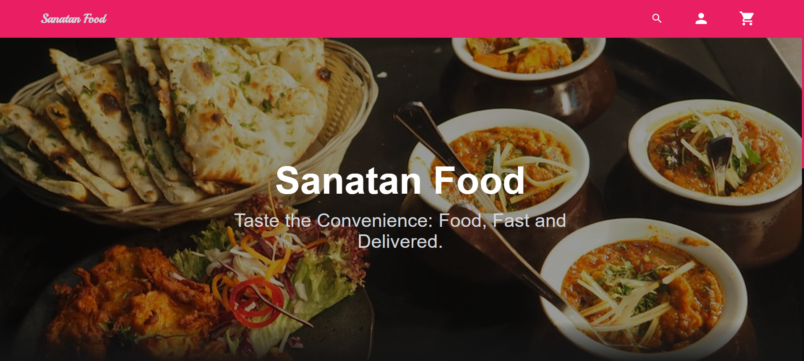

# 🍽️ Sanatan Food – Full Stack Food Ordering Platform


<p align="center">
  
</p>
<p align="center">
  
  
  
  
  
  
</p>


## 🚀 Project Overview
**Sanatan Food** is a **complete full‑stack food ordering and restaurant management platform** designed using **real‑world backend and frontend practices**.

This project is suitable for:
- ✅ Final year projects  
- ✅ Startup MVP  
- ✅ Portfolio / Resume  
- ✅ Real‑world backend learning  

It follows **clean architecture**, **role‑based access**, and is **production‑deploy ready**.

---
## 🌟 Key Highlights
✔ Full Stack Architecture (Frontend + Backend)  
✔ Role Based Access (Customer / Admin / Super Admin)  
✔ Secure JWT Authentication  
✔ RESTful APIs  
✔ Clean DTO-based communication  
✔ Docker & Docker‑Compose support  
✔ Scalable & Cloud‑ready  


---
## 🧠 System Architecture Flow

```text
┌──────────────┐
│ React UI     │
│ (Frontend)   │
└──────┬───────┘
       ↓
┌──────────────┐
│ REST APIs    │
│ Spring Boot  │
└──────┬───────┘
       ↓
┌──────────────┐
│ Service Layer│
│ Business     │
└──────┬───────┘
       ↓
┌──────────────┐
│ Repository   │
│ JPA/Hibernate│
└──────┬───────┘
       ↓
┌──────────────┐
│ MySQL DB     │
└──────────────┘
```

---
## 👥 User Roles & Permissions
### 👤 Customer
- Browse restaurants & menu
- Add items to cart
- Place orders
- Track order status

### 🧑‍🍳 Admin
- Manage restaurant
- Add / update food items
- View orders
- Update order status

### 👑 Super Admin
- Manage all users
- Platform‑level control
- Analytics & insights

---
## 🛠️ Tech Stack
### Backend
- Java 17
- Spring Boot
- Spring Security (JWT)
- Spring Data JPA
- Hibernate
- MySQL
- Maven

### Frontend
- React (Create React App)
- Tailwind CSS
- React Router
- Context / State Management
- Chart.js (Admin Analytics)

### DevOps
- Docker
- Docker Compose

---

## 📁 Actual Backend Project Structure
```text
backend-spring-boot/
├── src/main/java/com/sanatan
│   ├── config        # Configuration classes
│   ├── controller    # REST Controllers
│   ├── domain        # Core domain logic
│   ├── dto           # Data Transfer Objects
│   ├── exception     # Custom exception handling
│   ├── model         # JPA Entities
│   ├── repository    # Data access layer
│   ├── request       # API request models
│   ├── response      # API response models
│   ├── service       # Business logic
│   └── SanatanFoodApplication.java
│
├── src/main/resources
│   └── application.properties
│
├── pom.xml
└── README.md
```

---
## 📁 Actual Frontend File Structure

```text
FRONTEND-REACT/
├── node_modules/
├── public/
│   └── index.html
│
├── src/
│   ├── Admin/            # Admin dashboard pages & components
│   ├── SuperAdmin/       # Super Admin specific controls & views
│   ├── customers/        # Customer-facing pages (home, cart, orders)
│   │
│   ├── config/           # App-level configuration (API URLs, constants)
│   ├── Data/             # Static / mock data files
│   ├── Routers/          # React Router configuration
│   ├── State/            # Global state management (context / store)
│   ├── theme/            # Theme setup
│   │   └── DarkTheme.js  # Dark mode configuration
│   │
│   ├── App.js            # Root application component
│   ├── App.css           # App-level styles
│   ├── App.test.js       # App tests
│   ├── index.js          # Application entry point
│   ├── index.css         # Global styles
│   ├── logo.svg
│   ├── reportWebVitals.js
│   └── setupTests.js
│
├── tailwind.config.js    # Tailwind CSS configuration
├── package.json
├── package-lock.json
├── .gitignore
└── README.md
```

---

## ⚙️ Local Setup
### Backend

```bash
git clone https://github.com/your-username/Sanatan-Food-Backend.git
cd backend
mvn spring-boot:run
```

Backend runs on:
```
http://localhost:8080
```

### Frontend

```bash
cd frontend
npm install
npm start
```

Frontend runs on:
```
http://localhost:3000
```

---

## 🔐 JWT Authentication Flow

```text
Login → JWT Token Generated → Stored on Client → Sent in Authorization Header
```

✔ Secure APIs  
✔ Role‑based access  
✔ Stateless authentication  

---
## 📦 Docker & Docker‑Compose
### Run Entire Project

```bash
docker-compose up --build
```

Services:
- Backend → 8080
- Frontend → 3000
- MySQL → 3306

---

## 📊 Admin Analytics Dashboard

- 📦 Total Orders
- 💰 Revenue Tracking
- 👥 User Growth
- 🍽 Most Ordered Items
- 📈 Graphical Charts

---

## 🛣 Roadmap

✔ Backend APIs  
✔ Frontend UI  
✔ JWT Security  
✔ Docker Setup  
⬜ Payment Gateway  
⬜ Cloud Deployment  
⬜ CI/CD Pipeline  
⬜ Microservices  

---

## 🤝 Contribution Guide
```bash
1. Fork Repository
2. Create Feature Branch
3. Commit Changes
4. Push to Branch
5. Open Pull Request
```
---
## 👨‍💻 Author & Contributors
<a href="https://github.com/gitKeshav11/Sanatan_Food-Full_Stack_Project/graphs/contributors">
  
</a>

## 📞 Contact
### **Keshav Upadhyay**  
**Role:** Backend Developer (Java & Spring Boot)  
📧 Email: [keshavupadhyayje@gmail.com](mailto:keshavupadhyayje@gmail.com)  
🔗 LinkedIn: [Keshav Upadhyay](https://www.linkedin.com/in/keshavupadhyayje/)  
🐙 GitHub: [gitKeshav11](https://github.com/gitKeshav11)  


### **Jyoti Singh**  
**Role:** Frontend Support / Collaborator  
📧 Email: [kumarijyotije@gmail.com](mailto:kumarijyotije@gmail.com)  
🔗 LinkedIn: [Jyoti Singh](https://www.linkedin.com/in/jyotisinghje/)  
🐙 GitHub: [Jyotisingh133](https://github.com/Jyotisingh133)  

-------
**Sanatan Food** aims to blend **modern technology with traditional values**, delivering a clean, scalable, and meaningful digital food platform.

------
⭐ If you like this project, don’t forget to **STAR ⭐ the repository*
